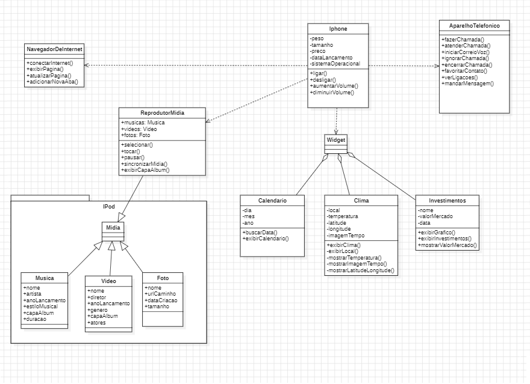

# Diagramação de classes do IPhone

Com base no vídeo de lançamento do iPhone conforme link [Steve Jobs apresenta primeiro IPhone legendado (2007)](https://www.youtube.com/watch?v=9ou608QQRq8&ab_channel=TuchilaRino), foi elaborada uma diagramação das classes e interfaces com a proposta de representar os papéis do iPhone de: Reprodutor Musical, Aparelho Telefônico e Navegador na Internet.

- Minutos relevantes do vídeo 00:15 até 00:55

Em seguida foram criadas as classes e interfaces no formato de arquivos .java

- [Fabrica](src/estabelecimento/Fabrica.java)
- [IPhone](src/equipamento/Iphone.java)
- [Aparelho Telefônico](src/equipamento/AparelhoTelefonico.java)
- [NavegadorInternet](src/estabelecimento/NavegadorInternet.java)
- [ReprodutorMidia](src/equipamento/ReprodutorMidia.java)

## Comportamentos esperados

- Reprodutor Musical: tocar, pausar, selecionarMusica, sincronizarDados;

- Aparelho Telefônico: ligar, atender, iniciarCorreioVoz;

- Navegador na Internet: exibirPagina, adicionarNovaAba, fecharAba, atualizarPagina.

- [Link do Desafio](https://github.com/digitalinnovationone/trilha-java-basico/tree/main/desafios/poo#comportamentos-esperados)
